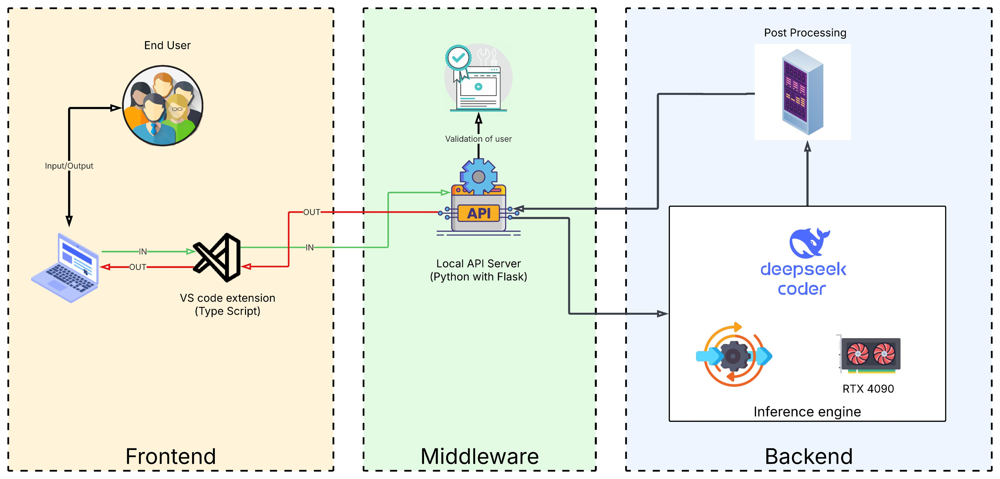

# 🚀 Code Genie

Code Genie is a VS Code extension powered by the DeepSeek model. It reads special prompts written in comments, sends them to a Flask backend, and gets AI-generated code responses — all without leaving your code editor!

---

## ✨ Features

- 🧠 AI-powered code generation using DeepSeek
- 📌 Recognizes prompts in comments
- 🔄 Supports multiple programming languages
- ⚡ Built with Flask (backend) + TypeScript (VS Code extension)
- 📎 Plug-and-play experience inside VS Code

---

## 🧱 Architecture

This diagram illustrates the core components and their interactions:




---


## 🛠️ Tech Stack

- **Frontend**: VS Code Extension (TypeScript)
- **Backend**: Flask
- **AI Model**: DeepSeek (running on a separate model server)

---

## 🚀 How to Use

1. Clone this repo:
   ```bash
   git clone https://github.com/MoluguSrinithi/Code_Genie.git
